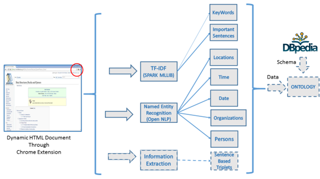

# Documentics
<h2>Document Semantic Analyzer App</h2>

<b>Introduction: </b>

Our Project provides source code for the functionality to analyze the semantics of provided web page. Extensions are great way to enhance browsing experience, so we have designed a Google Chrome extension which will take the current webpage URL and perform semantic based analysis on the webpage. We have used different information retrieval techniques which we mentioned below to do analysis.

<b>TF-IDF:</b> Provides the importance of each and every word in a specific document among corpus of other data. 

<b>Sentiment Analysis:</b> Refers to the use of natural language processing, text analysis and computational linguistics to identify and extract subjective information in source materials. It determines contextual polarity of a document.

<b>Entity Extraction:</b> Classifies elements in corpus into predefined categories such as the names of persons, organizations, locations, expressions of times, quantities, monetary values, percentages, etc. AlchemyAPI named entity extraction is capable of identifying people, companies, organizations, cities, geographic features and other typed entities from your HTML, text or web-based content
  Example:
                Jim bought 300 shares of Acme Corp. in 2006.
               [Jim]Person bought 300 shares of [Acme Corp.]Organization in [2006]Time. 

<b>Text Runner :</b> Is a kind of Open Information Extraction(OIE), which makes single, data-driven pass over the entire corpus and extracts a large set of relational tuples, without requiring any human input.

<b>Technologies Used: </b>

<i> Web Technologies </i>             	: HTML5, CSS, JavaScript 

<i>Programming languages</i>           	: Java, Scala	

<i>IDE’s used</i>                	      : Eclipse, Intellij, WebStorm 

<i>Services Used</i>                  	: AlchemyAPI

<i>API’s used</i>                       : TextRunner, Entity Extractor , TF-IDF, Stanford Core NLP, d3js, WordNet, LDA 

<i>Analytic tools</i>                   : Apache Spark	

 
<b>Our project contains two major sub-projects:</b>

1. Chrome Extension: It contains the source code related to the chrome extension which will consumes the current web page URL and   performs semantic based web page analysis.

2. Machine Learning: It contains source code related to the sentiment analysis on the sentences.

All the semantic analyser techniques extract information from different documents or web page. A key element is the linking together of the extracted information together to form new facts or new hypotheses to be explored further by more conventional means of experimentation. The linking together gives way to ontology and web semantics

<b>Limitations and drawbacks:</b>

Google extension app has to added to google store for usage of all the web page formats. In the current version google restricts access of the web pages.

<b>Future Work:</b>

This project is inteded to act like an automatic ontology generator from web pages based on DBPedia Schema.

